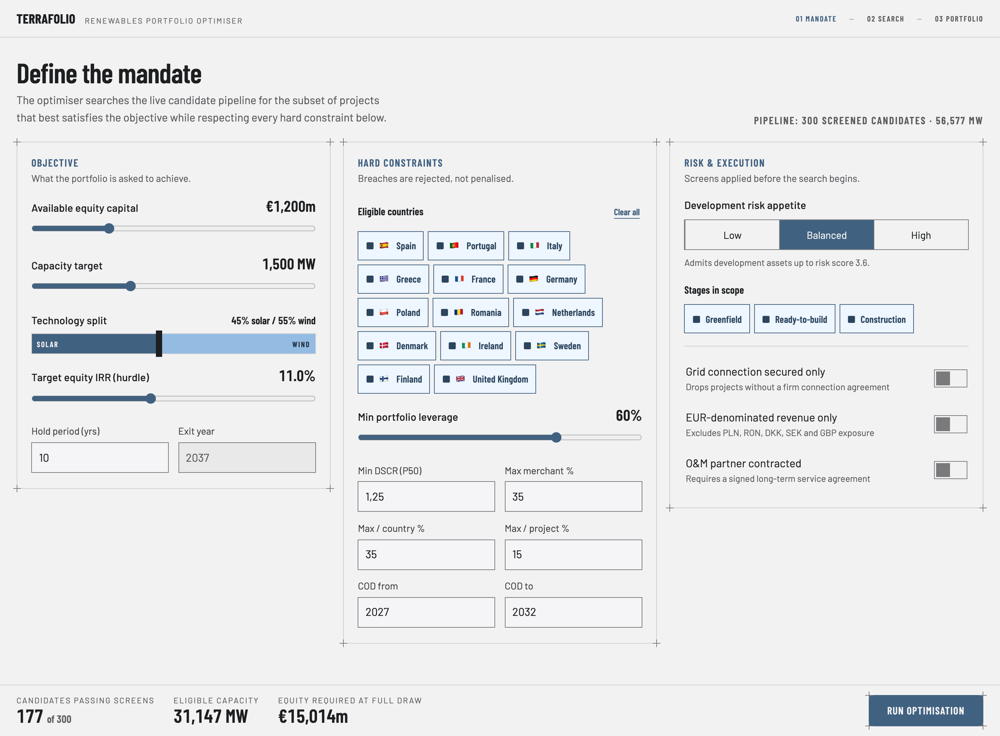
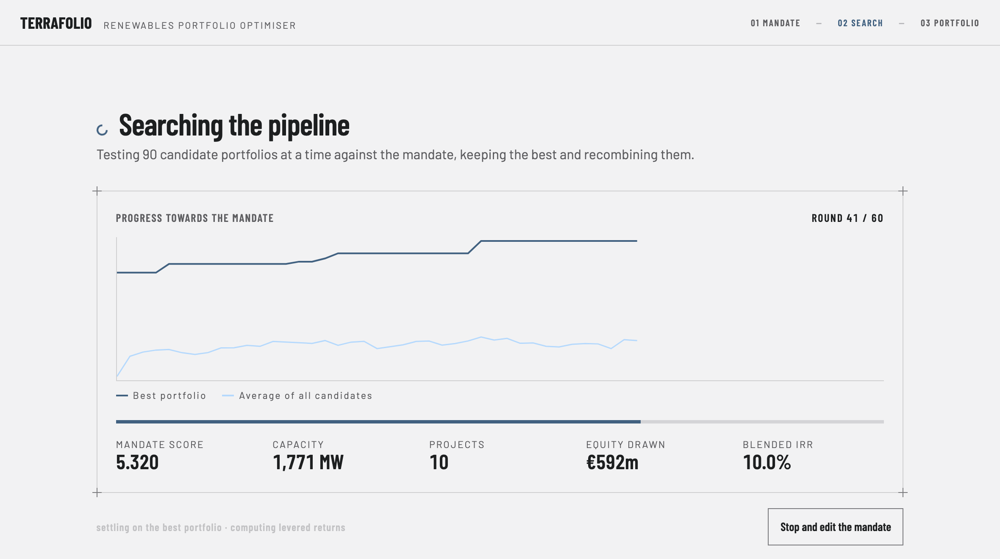
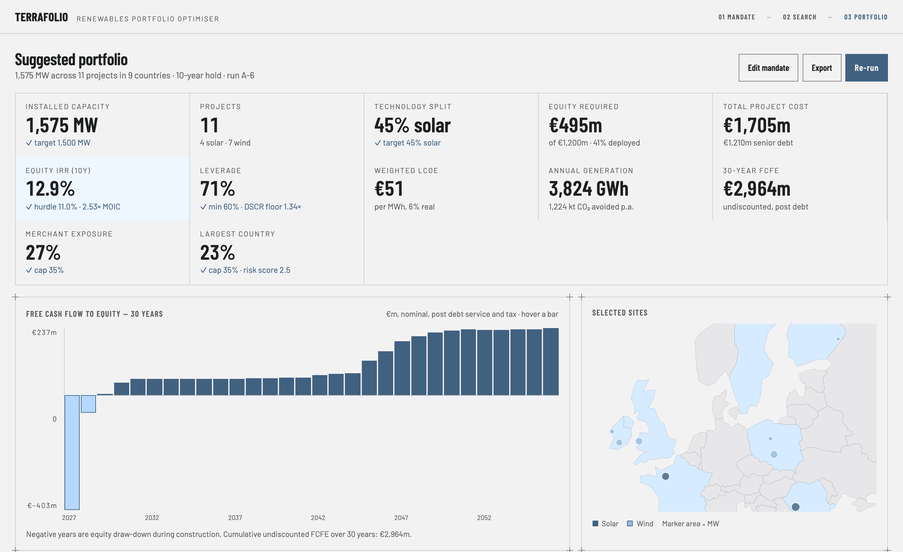
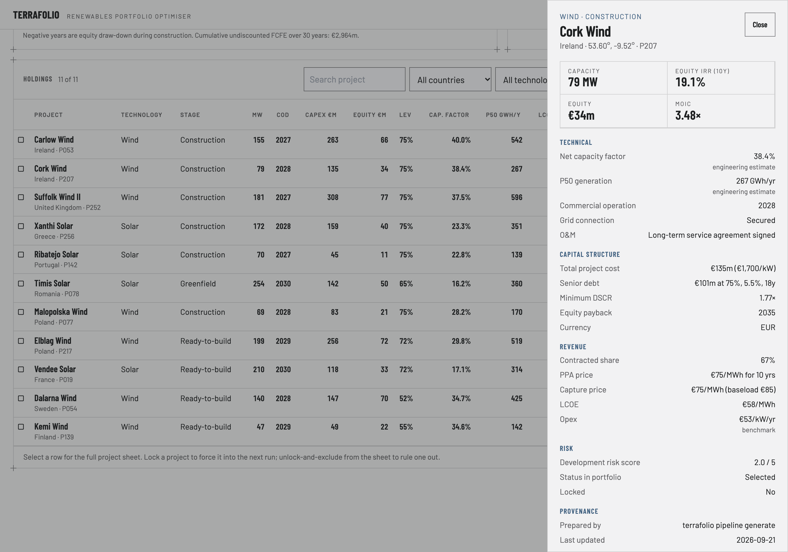

# TerraFolio

**A renewables portfolio optimiser: a mandate in, an investment-committee-ready portfolio out.**

An investment professional states a **mandate** — equity available, capacity target, technology
split, IRR hurdle, hold period — plus hard constraints (eligible countries, minimum leverage,
minimum DSCR, merchant and concentration caps, a COD window) and risk and execution screens.
TerraFolio searches a live pipeline of solar and wind projects and returns the **subset** that best
satisfies that mandate, with the portfolio metrics and per-project detail needed to take it to an
investment committee.

It is not a ranking problem. A 300-project pipeline has more subsets than can be enumerated, the
objectives conflict (capacity against return, diversification against quality), and several
constraints — leverage, merchant exposure, country and single-asset concentration — are properties
of the *portfolio*, so no per-project score produces the right answer. Today the work is done by
hand in spreadsheets: two to three days per mandate, one answer, and no record of the alternatives
that were passed over.

TerraFolio returns that answer in **about half a second**, with every constraint accounted for and
every assumption recorded and reproducible.

---

## The three screens

One linear path, with a loop back from the result to the mandate.

```
01 Mandate  ──▶  02 Search  ──▶  03 Portfolio
     ▲                                  │
     └──────────── edit / re-run ◀───────┘
```

### 01 · Define the mandate

Objective, hard constraints and pre-search screens. The footer counts the eligible candidates, the
capacity they represent and the equity it would take to buy all of them, and it updates as you move
a control — computed in the browser, so it keeps up with the slider. If a mandate is infeasible, it
says so before the run starts.



### 02 · Watch the search

A genetic algorithm searches the subset space. Both curves are real per-generation data streamed
from the engine over Server-Sent Events — the best portfolio found so far and the average across the
whole population — alongside the running best portfolio's headline figures.



### 03 · Read the portfolio

Twelve headline tiles, each stating the mandate figure it is measured against; a 30-year
free-cash-flow-to-equity chart; and a map of the selected sites, sized by capacity. Compliance is
never encoded in colour alone — a tick or an exclamation mark carries the status, and the number it
was judged against sits next to it.



### Holdings and the project sheet

Below the fold, a sortable and filterable holdings table, and a detail sheet for any project
carrying its technicals, capital structure, revenue, risk — and its **provenance**: who prepared the
file, when, and how firm each input is. From here you lock a project into the next run, or exclude
it and re-run.



All four are photographs of the running application against the shipped pipeline, regenerated by
[`tools/readme-shots.mjs`](tools/readme-shots.mjs) — the run behind them is pinned to a seed, so
they reproduce rather than drift.

---

## How it works

**The pipeline is a directory of project files, one per park.** Each carries that project's full
30-year financials as modelled by the analyst who follows it — income statement, cash flow
statement, balance sheet, debt schedule and ratios — alongside identity, capital structure,
contracts and risk attributes. You add a project by dropping a file in and remove one by deleting
it. The repository ships a seed pipeline of 300 such files, generated by the house financial model
so the application runs against real, internally consistent data out of the box.

Three hundred independently-authored models only aggregate into something a committee can trust if
the loader proves each one coherent, so the **tie-out validator** and the **cross-file dispersion
report** are first-class features rather than plumbing: no file is loaded until its statements tie
out to within €0.01m or 0.1%, and `terrafolio pipeline validate` reports where the pipeline's files
disagree with one another about a shared assumption.

**Everything mandate-dependent is computed at run time.** No IRR, MOIC, terminal value or payback is
ever stored in a file, which is what keeps the hold-period slider honest.

**Every run is reproducible.** A run records its resolved seed, the pipeline hash, per-file content
hashes, the assumption-set id, the engine version, the numpy version and the BLAS thread count.
The same mandate, the same pipeline snapshot and the same seed produce a bit-identical portfolio —
from the browser, from the HTTP API, or from the CLI.

**Anything on screen leaves the building.** *Export* writes the holdings and the 30-year cash flow
as CSV, each carrying the mandate and the run's provenance in its header, and an investment
committee sheet as one self-contained HTML document with no external references, laid out to print.
All three are generated server-side from the stored result, so what gets circulated and what was
actually run cannot drift apart.

Every rate, weight, floor, clamp, tolerance and band lives in [`assumptions/default-2026.toml`](assumptions/default-2026.toml),
never in code, so changing one is an auditable event.

**Stack.** Python 3.13, FastAPI, pydantic v2 and numpy (pinned exactly) on the back end, with
stdlib `sqlite3` for the run store — no scipy, no pandas. The front end is plain HTML, Tailwind and
Alpine.js with no bundler beyond the Tailwind CLI; `d3-geo` draws the map and both charts are
hand-built from divs and inline SVG.

---

## Running it

### Prerequisites

- **Python 3.13** (`>=3.13,<3.14`) and [uv](https://docs.astral.sh/uv/)
- **Node 22**, for the Tailwind build only — the application does not need Node at runtime

### Install

```bash
uv sync
npm --prefix web ci
npm --prefix web run build
```

`uv sync` creates `.venv` and installs the runtime and dev dependencies. The last step compiles
`web/src/input.css` into `web/dist/app.css`, which is not committed — skip it and the pages render
unstyled.

### Start the server

```bash
uv run terrafolio serve
```

Then open **http://127.0.0.1:8000**. It binds loopback on purpose: pipeline data is commercially
sensitive and nothing here authenticates. Pass `--host`/`--port` to change that, `--pipeline DIR`
to point at a different pipeline, and `--db PATH` to move the SQLite run store (default
`./terrafolio.db`).

### The CLI

The whole compute spine works without HTTP, which is the quickest way to see it run:

```bash
uv run terrafolio pipeline validate   # load, tie out, and report cross-file dispersion
uv run terrafolio preview             # the feasibility footer for a mandate, and what to widen
uv run terrafolio run --seed 3        # a full search, printing the twelve headline tiles
uv run terrafolio bench               # time the load and the search at each effort level
```

`terrafolio run --seed 3` against the shipped pipeline reproduces the portfolio in the screenshots
above:

```
Run complete in 627 ms · seed 3 · effort standard · fitness 6.331658
Pipeline sha256:7a754747337ae6cd… · assumptions 0e3fcf6de33d7fec

Selected 11 projects:
  P019, P053, P054, P077, P078, P139, P142, P207, P217, P252, P256

Headline metrics:
  Installed capacity          1,575 MW   target 1,500 MW (+5.0%)
  Projects                          11   4 solar · 7 wind
  Technology split         44.8% solar   target 45.0% (-0.2 points)
  Equity required                €495m   of €1,200m · 41.3% deployed
  Total project cost           €1,705m   €1,210m senior debt
  Equity IRR (10y)               12.9%   hurdle 11.0% · 2.53× MOIC [compliant]
  Leverage                       71.0%   min 60.0% · DSCR floor 1.34× [compliant]
  Weighted LCOE                    €51   per MWh, real
  Annual generation          3,824 GWh   1,224 kt CO2 avoided p.a.
  30-year FCFE                 €2,964m   undiscounted, post debt
  Merchant exposure              27.2%   cap 35.0% [compliant]
  Largest country             IE 23.3%   cap 35.0% · risk score 2.52 [compliant]
```

`terrafolio pipeline generate`, `ingest` and `export` round-trip the pipeline through the house
model and through the analyst-facing spreadsheet.

### Performance

`terrafolio bench` on an Apple M2, against the shipped 300-file pipeline:

| Step | Time |
|---|---|
| Pipeline load — 300 files parsed, validated, tied out | 1.9 s |
| Search · Fast (50 × 35) | 240 ms |
| Search · Standard (90 × 60) | 558 ms |
| Search · Exhaustive (160 × 110) | 1,117 ms |

Searches are the best of three; population × generations in brackets.

The budgets they are held against are five seconds for a Standard run and two for the load.

### Tests

```bash
uv run pytest            # 1,367 tests
uv run ruff check .
uv run mypy src
npm --prefix web test    # 479 browser tests, incl. accessibility and contrast audits
```

---

## Documentation

| Document | What it is |
|---|---|
| [`docs/spec.md`](docs/spec.md) | The v1.0 product specification. Cited throughout by section number. |
| [`docs/pipeline-schema.md`](docs/pipeline-schema.md) | The project file template: every field, unit, domain and validation rule, plus the tie-out table. Normative. |
| [`docs/ui-contract.md`](docs/ui-contract.md) | Every control, tile, table column, chart and warning string, with formats. |
| [`docs/api.md`](docs/api.md) | The wire contract: endpoints, shapes, status codes, SSE events, the ETag rule. |
| [`docs/decisions.md`](docs/decisions.md) | Spec deviations, resolved ambiguities and open questions, with the measurements behind them. |

## Licence

MIT — see [LICENSE](LICENSE).
